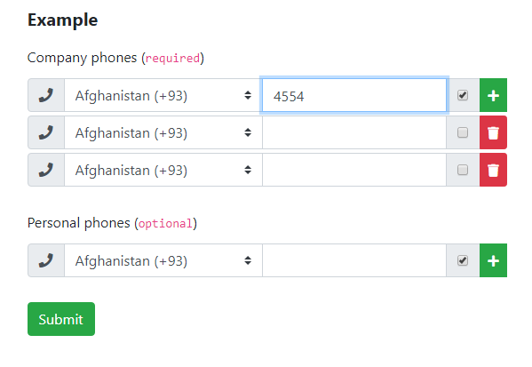

# Jquery Phone Inputs

Manage multiple or unique phone number inputs.

## Visuals



[Demo link](https://lambou.github.io/jquery-phone-inputs-demo/)

## Installation

### Dependencies
Include dependencies:
* [jQuery]()
```javascript
<script src="https://code.jquery.com/jquery-3.3.1.min.js" integrity="sha256-FgpCb/KJQlLNfOu91ta32o/NMZxltwRo8QtmkMRdAu8=" crossorigin="anonymous"></script>
```

> Any version of jquery, but preferably a recent version.

### Plugin

Include the plugin script.

```javascript
<script src="path_to_plugin/dist/jquery.phone.inputs.js"></script>
```
OR minimized version

```javascript
<script src="path_to_plugin/dist/jquery.phone.inputs.min.js"></script>
```

## Usage

### Phone number input template
Add the template script. This phone number line template is based on [Boostrap 4.3](https://getbootstrap.com/docs/4.3/getting-started/introduction/). Your can create your own as needed.

```html
<script type="text/html" id="phone-inputs-line-template">
    <div class="row phone-inputs-line my-1">
        <div class="col-sm-12">
            <div class="input-group">
                <div class="input-group-prepend">
                    <span class="input-group-text"><i class="fas fa-phone"></i></span>
                </div>
                <select class="custom-select"></select>
                <input type="text" class="form-control">
                <div class="input-group-append">
                    <div class="input-group-text phone-inputs-default-checkbox-section"><input type="checkbox"></div>
                    <button type="button" class="btn btn-success btn-sm btn-phone-inputs-add-line"><i
                            class="fa fa-plus"></i></button>
                    <button type="button" class="btn btn-danger btn-sm btn-phone-inputs-delete-line"><i
                            class="fa fa-trash"></i></button>
                </div>
            </div>
        </div>
    </div>
</script>
```

> You can change anything you want in the template but there are some requirements:
> The phone input line must have a class (`phone-inputs-line` in the example below).
> You can use a custom class but you will define it in `lineClass` option while initializing.

> The phone input line must have exactly: one `select` input for country
> The phone input line must have exactly: one `input[type="text"]` input for number
> The phone input line must have exactly: one `checkbox` input for the default number selection.

> The `phone-inputs-default-checkbox-section` class is optional but sometimes as in the template below, it is required for good presentation of the checkbox in the line.

### Phone number input error template
Add the template error script. This phone number line template is based on [Boostrap 4.3](https://getbootstrap.com/docs/4.3/getting-started/introduction/). Your can create your own as needed.

```html
<script type="text/html" id="phone-inputs-line-error-template">
    <div class="col-md-12">
        <div class="invalid-feedback" role="alert">
            <strong>%%error%%</strong>
        </div>
    </div>
</script>
```

### Phone number input container
Add the inputs container

```html
<div class="phone-inputs" data-form-name="phones" required></div>
```

### Initialisation
Initialisation script

```javascript
$('.phone-inputs').phoneInputs({
    'countriesUrl': 'https://restcountries.eu/rest/v2/all',
    'multiple': true,
    'countryCodeAttr': 'alpha2Code',
    'countryNameAttr': 'name',
    'countryCallPrefix': 'callingCodes',
    'limit': 5,
    'lineTemplate': '#phone-inputs-line-template',
    'inputName': 'phone',
    'required': true
});
```

### Options
A few options.

| Option | Default | Description |
| ------ | ------ | ------------- |
| countriesUrl | https://restcountries.eu/rest/v2/all | Countries API endpoint|
| multiple | true | define is many phone number can be added|
| defaultCountry | null | Country alpha 2 code. Example: CM, FR, EN|
| countryCodeAttr | 'alpha2Code' | Country `alpha 2 code` attribute name in the api response|
| countryNameAttr | 'name' | Country `name` attribute name in the api response |
| countryCallPrefix | 'callingCodes' | Country `call prefix` attribute name in the api response |
| limit | 5 | You can only add at least `limit` phone numbers |
| lineTemplate | '#phone-inputs-line-template' | Selector of the phone input line html template |
| lineErrorTemplate | '#phone-inputs-line-error-template' | Error template selector. it must contain `%%error%%` key that will be replaced by the current error |
| inputName | 'phone' | Name of the input while submitting form: optional when multiple is `true` |
| inputCountryName | 'country' | country field name in the form |
| inputNumberName | 'number' | number field name in the form |
| inputDefaultName | 'default' | default field name in the form |
| inputNameAttr | 'data-form-name' | Attribute of the phone inputs container with define the name of phone number(s) inputs during form submitting' |
| inputCountryNameAttr | 'data-form-country-name' | container attribute for country name in form |
| inputNumberNameAttr | 'data-form-number-name' | container attribute for number name in form |
| inputDefaultNameAttr | 'data-form-default-name' | container attribute for default name in form |
| dataAttr | 'data' | default phone numbers to initialize the input |
| dataErrorsAttr | 'data-errors' | after submitting data the server will return errors. the format or error will be `inputName.index.inputNumberName` example: `{"phones.0.number": "This number is invalid", "phones.1.number": "This number is invalid"}` or `{"phones.1.number": "This number is invalid","phones.0.number": ["This number is invalid", "The selected country is not authorized"]}`  |
| required | true | Phone input is required |
| invalidClass | 'is-invalid' | class applied to the parent of the error message element |
| invalidMessageClass | 'invalid-feedback' | class applied to the error message element |

### Events

|Event|Description|
|------|-------|
| phone.inputs.debug | Listen to all events |
| phone.inputs.line.delete | When trying to delete phone number |
| phone.inputs.change | When something changed (line added, line removed, default phone number selected)  |
| phone.inputs.line.added | New line added  |
| phone.inputs.default.choose | When trying to choose the default phone number |

### Attributes

|Attribute|Description|
|------|-------|
| data-form-name | containt the name of the form input |
| data-form-country-name | containt the name of the form country select |
| data-form-number-name | containt the name of the form number input |
| data-form-default-name | containt the name of the form default checkbox |
| required | phone number input is required |

## Roadmap
* Validation based on [Google i18n Libphonenumber](https://github.com/googlei18n/libphonenumber)

## Contributing
Pull requests are welcome. For major changes, please open an issue first to discuss what you would like to change.

Please make sure to update tests as appropriate.

## License
[MIT](LICENSE.txt)
